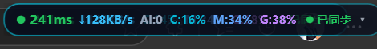
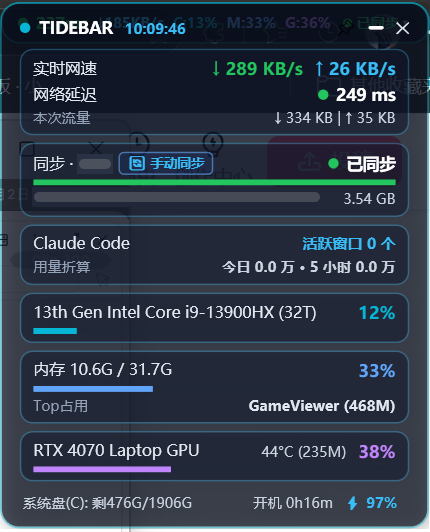

# Tidebar

[English](README.md) | **简体中文**

一条常驻桌面角落的小胶囊：平时只占一行，鼠标移上去展开成完整看板，看电影、打游戏全屏时自动躲开。

给同时开着好几个 AI 智能体窗口的人用：CPU、内存、网络、文件同步，还有 Claude Code 的用量，一眼看完。

**Mac 和 Windows 都是原生程序，零安装：下载、解压、双击就能用。**

<p align="center">
  <br>
  <sub>平时：角落里的一行</sub>
</p>
<p align="center">
  <br>
  <sub>鼠标移上去展开（Windows 版，个人设备名已遮挡）</sub>
</p>

## 下载

到 [Releases](../../releases/latest) 页面下载最新版：

| 系统 | 文件 | 要求 |
|---|---|---|
| Windows | `Tidebar-windows.zip` | Windows 10 / 11（系统自带的 .NET Framework 4.8 即可，不用另装任何东西） |
| macOS | `Tidebar-mac.zip` | macOS 13 及以上，Apple 芯片和 Intel 都支持 |

### 第一次打开会被系统拦一下（正常现象）

这个项目没有花钱买开发者证书，所以第一次运行时系统会提醒你：

- **Windows**：弹出「Windows 已保护你的电脑」→ 点「更多信息」→「仍要运行」。
- **macOS**：提示「无法验证开发者」→ 打开「系统设置 → 隐私与安全性」，往下拉找到 Tidebar，点「仍要打开」。

代码全部公开在这个仓库里，可以自己检查，也可以自己编译（见下文）。

## 能看到什么

| 模块 | 内容 | 默认 |
|---|---|---|
| 系统 | CPU、内存（以及最占内存的程序）、系统盘剩余空间、开机时长 | 开 |
| 显卡（Windows） | NVIDIA 显卡的占用、温度、显存（没有 N 卡自动隐藏） | 自动 |
| 网络 | 实时网速、本次流量、网络延迟 | 开 |
| Claude Code | 活跃窗口数、今日 / 5 小时用量；Mac 版另有本周账本和每个窗口的上下文红绿灯 | 装了才显示 |
| Syncthing | 同步进度、对端设备在线状态、一键手动同步 | 装了才显示 |
| Antigravity（Mac） | 任务在跑 / 等你处理 / 空闲 | 装了才显示 |

所有数据只在你自己电脑上读取和显示，**不联网上传任何东西**。唯一的联网动作是测网络延迟（默认访问 `cp.cloudflare.com/generate_204`，可在配置里改掉或关掉）。

## 设置

右键胶囊（Mac 点菜单）→「打开配置文件」，改完点「重新加载配置」。

- Windows：`%APPDATA%\Tidebar\config.ini`
- macOS：`~/Library/Application Support/Tidebar/config.json`

每个模块都能单独关掉；网络延迟可以换测速地址、指定走哪个本机代理。

## 自己编译

- **Windows**：不用装 Visual Studio，用系统自带的编译器：
  ```powershell
  powershell -ExecutionPolicy Bypass -File windows\build.ps1
  ```
  产物在 `windows\dist\Tidebar.exe`。
- **macOS**：装好 Xcode 命令行工具后：
  ```bash
  cd mac && ./build.sh
  ```
  产物在 `mac/dist/Tidebar.app`。

## 许可

MIT
